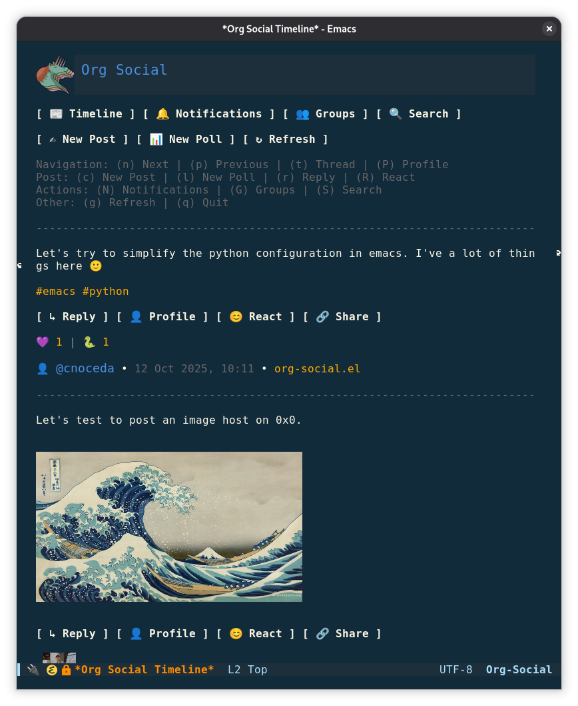
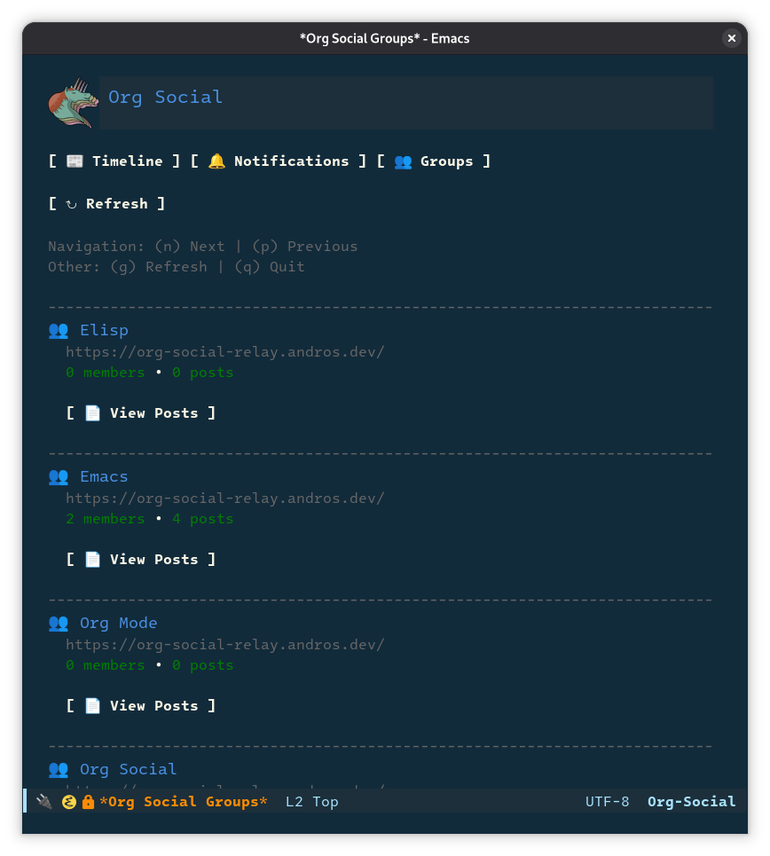

# org-social.el

An Emacs client for [Org Social](https://github.com/tanrax/org-social), a decentralized social network that works with Org Mode files over HTTP.







## 🚀 Quick Start

### New to Org Social?

Follow this quick tutorial to get started without needing to know all the technical details:

**[Quick Tutorial to Get Started on Org Social](https://en.andros.dev/blog/ddd78757/quick-tutorial-to-get-started-on-org-social/)**

### Complete Setup Example

If you want a minimal working configuration, add this to your `init.el`:

```elisp
;; Configure package archives
(require 'package)
(add-to-list 'package-archives '("melpa" . "https://melpa.org/packages/") t)
(package-initialize)

;; Install use-package if not already installed
(unless (package-installed-p 'use-package)
  (package-refresh-contents)
  (package-install 'use-package))

(require 'use-package)
(setq use-package-always-ensure t)

;; Install dependencies and org-social
(use-package request)
(use-package emojify)

(use-package org-social
  :config
  ;; Option 1: Local file + your own hosting
  (setq org-social-file "~/social.org")
  (setq org-social-relay "https://relay.org-social.org/")
  (setq org-social-my-public-url "https://example.com/social.org")

  ;; Option 2: Using Org Social Host (uncomment and use your credentials)
  ;; (setq org-social-file "http://host.org-social.org/vfile?token=YOUR_TOKEN&ts=TIMESTAMP&sig=SIGNATURE")
  ;; (setq org-social-relay "https://relay.org-social.org/")
  ;; (setq org-social-my-public-url "http://host.org-social.org/your-nick/social.org")

  ;; Optional: Add global keybindings
  (keymap-global-set "C-c s t" #'org-social-timeline)
  (keymap-global-set "C-c s n" #'org-social-new-post))
```

After adding this configuration, restart Emacs or evaluate the code.

### First Steps

Once installed and configured:

- **View timeline**: `M-x org-social-timeline` or `C-c s t`
- **Create new post**: `M-x org-social-new-post` or `C-c s n`
- **Navigate posts**: Press `n` (next) / `p` (previous) in the timeline
- **Reply to posts**: Press `r` on a post in the timeline
- **Discover users**: Press `D` to browse and follow users from the relay

## 📦 Installation

### MELPA

```
M-x package-install RET org-social RET
```

### use-package

**Note:** Make sure you have MELPA configured in your Emacs. If not, add this to your init.el:

```elisp
(require 'package)
(add-to-list 'package-archives '("melpa" . "https://melpa.org/packages/") t)
(package-initialize)
```

#### Stable release

Install from MELPA with use-package:

```elisp
(use-package request
  :ensure t)
(use-package org-social
  :ensure t)
```

#### Development version

Install the development version from the `develop` branch:

```elisp
(use-package request)
(use-package org-social
  :vc (:url "https://github.com/tanrax/org-social.el"
       :rev "develop"))
```

#### Old version (v1)

To use the old version 1, use the `v1` branch:

```elisp
(use-package request)
(use-package org-social
  :vc (:url "https://github.com/tanrax/org-social.el"
       :rev "v1"))
```

#### Update version

```
M-x package-reinstall RET org-social RET restart-emacs RET
```

## ⚙️ Configuration

**Important**: The [Relay server](https://github.com/tanrax/org-social-relay/) is required for org-social.el to work. You can think of it as the client's backend, or software that synchronizes data. You can use:

- [Official instance](https://relay.org-social.org/)
- [Unofficial instances](https://raw.githubusercontent.com/tanrax/org-social/refs/heads/main/org-social-relay-list.txt)
- A [Relay instance](https://github.com/tanrax/org-social-relay/) on your local machine

### Required Configuration

#### Single Account

**Option 1: Local File + Your Own Hosting**

1. Create your [social.org](https://github.com/tanrax/org-social) file
2. Upload it to a web server so others can access it
3. Configure org-social.el:

```elisp
;; Required: Set the path to your social feed file
(setq org-social-file "~/social.org")

;; Required: Configure Org Social Relay server
;; See public relay list: https://github.com/tanrax/org-social/blob/main/org-social-relay-list.txt
(setq org-social-relay "https://relay.org-social.org/")

;; Required: Set your public social.org URL (where others can access your feed)
(setq org-social-my-public-url "https://example.com/social.org")
```

**Option 2: Using vfile (Org Social Host)**

If you don't have your own web server, you can use [Org Social Host](https://github.com/tanrax/org-social-host) for automatic hosting:

1. Sign up at the [public host](https://host.org-social.org/signup) to get your `vfile URL` and `public URL`
2. Configure org-social.el:

```elisp
;; Use your vfile URL from the host signup
(setq org-social-file "http://host.org-social.org/vfile?token=YOUR_TOKEN&ts=TIMESTAMP&sig=SIGNATURE")

;; Required: Configure Org Social Relay server
(setq org-social-relay "https://relay.org-social.org/")

;; Required: Set your public URL (from host signup)
(setq org-social-my-public-url "http://host.org-social.org/your-nick/social.org")
```

When using a vfile:
- The file is automatically downloaded from the host when you open it
- Your local copy is cached as `~/.emacs.d/v-social.org` (single-account) or `~/.emacs.d/v-social-ACCOUNT.org` (multi-account)
- Every time you save (`C-x C-s`), changes are automatically uploaded to the host
- Uses native Emacs url-retrieve functions (no external dependencies required)

#### Multi-Account Configuration

org-social.el supports multiple accounts, allowing you to manage different social feeds (e.g., personal, blog, work) from a single Emacs session.

**Using local files:**

```elisp
(require 'org-social-accounts)

(org-social-add-account "personal"
                        :file "~/social-personal.org"
                        :relay "https://relay.org-social.org/"
                        :public-url "https://example.com/personal.org"
                        :after-save-file-hook nil
                        :after-fetch-posts-hook nil)

(org-social-add-account "blog"
                        :file "~/social-blog.org"
                        :relay "https://relay.org-social.org/"
                        :public-url "https://blog.example.com/blog.org"
                        :after-save-file-hook (lambda ()
                                                 (message "Blog social file saved!"))
                        :after-fetch-posts-hook (lambda ()
                                                   (message "Blog posts fetched!")))

;; Set the default account to use
(org-social-switch-account "personal")

;; Switch accounts at any time with M-x org-social-switch-account
```

**Using vfiles (Org Social Host):**

```elisp
(require 'org-social-accounts)

(org-social-add-account "personal"
                        :file "http://host.org-social.org/vfile?token=TOKEN1&ts=TS1&sig=SIG1"
                        :relay "https://relay.org-social.org/"
                        :public-url "http://host.org-social.org/mynick/social.org")

(org-social-add-account "blog"
                        :file "http://host.org-social.org/vfile?token=TOKEN2&ts=TS2&sig=SIG2"
                        :relay "https://relay.org-social.org/"
                        :public-url "http://host.org-social.org/myblog/social.org")

;; Set the default account to use
(org-social-switch-account "personal")
```

When using vfiles with multi-account:
- Each account's vfile is cached separately: `~/.emacs.d/v-social-personal.org`, `~/.emacs.d/v-social-blog.org`
- Switching accounts automatically loads the correct cached file
- Saving uploads to the correct host account

### Optional Configuration

```elisp
;; Hide Reply, Vote, and Profile buttons for a cleaner timeline view. Change to 't' to hide them. Keyboard shortcuts 'r', 'v', and 'P' still work
(setq org-social-hide-post-buttons nil)

;; Set base URL for live post previews. When configured, a Share button will appear in post buttons
;; that opens the post preview in the system browser with URL-encoded post URL
;; Example: (setq org-social-live-preview-url "https://preview.org-social.org/?post=")
(setq org-social-live-preview-url "https://preview.org-social.org/?post=")

;; Use only relay followers instead of local follow list
(setq org-social-only-relay-followers-p nil)

;; Set default language for new posts and polls (optional)
;; When set, the :LANG: property will be automatically filled with this value
;; Examples: "en" for English, "es" for Spanish, "fr" for French
;; Leave as nil to keep :LANG: field empty (default behavior)
(setq org-social-default-lang nil)  ; or "en", "es", "fr", etc.

;; Maximum age of posts to fetch from feeds (in days)
;; Set to nil to download all posts without filtering (default: 14 days)
(setq org-social-max-post-age-days 14)  ; or 7, 30, nil, etc.

;; Maximum number of concurrent feed downloads
;; Limits parallel downloads to avoid overwhelming system resources
;; Recommended range: 10-30 (default: 20)
(setq org-social-max-concurrent-downloads 20)  ; or 10, 30, etc.

;; Filter timeline posts by language
;; Only show posts in specified languages (using :LANG: property)
;; Set to nil to show all posts regardless of language (default)
;; Examples: '("en") for English only, '("en" "es") for English and Spanish
(setq org-social-language-filter nil)  ; or '("en" "es"), '("en"), etc.

;; Enable real-time desktop notifications (requires relay and public URL)
;; When enabled, you'll receive instant notifications for mentions, reactions, replies, and boosts
;; Uses Server-Sent Events (SSE) from the relay server
;; Automatically connects when Emacs starts up
(setq org-social-realtime-notifications t)  ; set to t to enable

;; Optionally, configure global keybindings
(keymap-global-set "C-c s t" #'org-social-timeline)
(keymap-global-set "C-c s n" #'org-social-new-post)
(keymap-global-set "C-c s o" #'org-social-open-file)
(keymap-global-set "C-c s p" #'org-social-new-poll)
(keymap-global-set "C-c s m" #'org-social-mention-user)
```

You can also customize variables through Emacs' customization interface:

```
M-x customize-group RET org-social RET
```

### Known Limitations with Hosting Platforms

The optimized partial download feature (`org-social-max-post-age-days`) works best with traditional web servers. Some hosting platforms have limitations:

**Cloudflare CDN**
- Does not provide `Content-Length` or `Content-Range` headers
- **Fallback**: Automatically downloads full feed and filters client-side
- **Impact**: No bandwidth savings, but still works correctly

**Codeberg.org**
- Implements aggressive rate limiting (HTTP 429) when multiple feeds are downloaded simultaneously
- **Fallback**: Automatically downloads full feed without filtering when rate limit is detected
- **Impact**: May download older posts than configured `org-social-max-post-age-days`

**GitHub Raw Content**
- Provides proper HTTP Range support
- Works optimally with partial downloads

For best performance with partial downloads, host your `social.org` file on a traditional web server (Apache, Nginx, etc.) or GitHub/GitLab raw content URLs. The client handles all cases gracefully with automatic fallbacks.

## 📖 Usage

### Workflow

1. **Setup**: Configure `org-social-file`, `org-social-relay`, and `org-social-my-public-url`
2. **View timeline**: Use `M-x org-social-timeline` or `C-c s t`
3. **Navigate**: Use `n`/`p` to move between posts in the timeline
4. **Reply**: Press `r` when positioned on a post to create a reply
5. **Vote on polls**: Press `v` when positioned on a poll to vote
6. **Create posts**: Use `M-x org-social-new-post` or `C-c s n`
   - When creating a new post, you'll be prompted to choose visibility:
     - **public** (default): Post visible to everyone
     - **mention**: Post only visible to you and users you mention with `[[org-social:URL][username]]` links
7. **Create polls**: Use `M-x org-social-new-poll` or `C-c s p`
8. **Save and sync**: Use `C-x C-s` to save with hooks

### Post Visibility Control

org-social.el supports the VISIBILITY property from Org Social specification v1.5, allowing you to control who can see your posts:

- **Public posts** (default): Visible to everyone in their timeline
- **Mention-only posts**: Only visible to the post author and mentioned users

When creating a new post, you'll be prompted to choose the visibility level. If you select "mention", the post will include the `VISIBILITY:mention` property and will only appear in the timeline for:
- You (the post author)
- Users mentioned in the post body via `[[org-social:URL][username]]` links

**Note**: This is a UI display preference for clients, not a security feature. Your `social.org` file remains publicly accessible. For true privacy, use HTTP authentication on your web server.

**Example mention-only post**:
```org
**
:PROPERTIES:
:ID: 2025-12-29T15:30:00+0100
:VISIBILITY: mention
:END:

Hey [[org-social:https://alice.com/social.org][Alice]] and [[org-social:https://bob.org/social.org][Bob]], what do you think about this idea?
```

This post will only be visible to you, Alice, and Bob.

### Keybindings

#### In the timeline buffer

| Keybinding | Function | Description |
|------------|----------|-------------|
| `c`        | New post | Create a new post |
| `l`        | New poll | Create a new poll |
| `r`        | Reply | Reply to the post at point |
| `R`        | React | Add a reaction to the post at point |
| `n`        | Next post | Navigate to the next post |
| `p`        | Previous post | Navigate to the previous post |
| `t`        | View thread | View thread for current post |
| `P`        | View profile | View the profile of the post author |
| `N`        | Notices | View notices and mentions |
| `G`        | Groups | View groups |
| `D`        | Discover | Browse and follow users from the relay |
| `T`        | Timeline | Go back to timeline |
| `g`        | Refresh | Refresh the current view |
| `b`        | Kill buffer | Close the current buffer |
| `q`        | Quit | Quit Org Social UI |

#### In post content (Interactive Org Mode)

When your cursor is positioned in the content area of a post, you can use Org mode commands:

| Keybinding    | Function | Description |
|---------------|----------|-------------|
| `C-c C-c`     | org-ctrl-c-ctrl-c | Context-aware Org command (recalculate tables, execute code) |
| `C-c *`       | org-table-recalculate | Force recalculation of table formulas |
| `C-c C-v C-e` | org-babel-execute-src-block | Execute source code block |

### Interactive Org Mode Features

Posts in org-social.el support **interactive Org mode features**, allowing tables with formulas, executable code blocks, and other dynamic content to work directly in the timeline and thread views.

#### Tables with Formulas

Create posts with Org mode tables and formulas that can be recalculated:

```org
**
:PROPERTIES:
:ID: 2025-01-15T10:00:00+0100
:END:

Monthly budget:

| Category  | Amount | Percentage |
|-----------+--------+------------|
| Rent      |   1200 |      48.00 |
| Food      |    400 |      16.00 |
| Transport |    200 |       8.00 |
| Savings   |    400 |      16.00 |
|-----------+--------+------------|
| Total     |   2200 |     100.00 |
#+TBLFM: @2$3=100*$2/@6$2;%.2f::@3$3=100*$2/@6$2;%.2f::@4$3=100*$2/@6$2;%.2f::@5$3=100*$2/@6$2;%.2f::@6$2=vsum(@2..@5)::@6$3=vsum(@2..@5)
```

**How to use:** Position your cursor on any table cell and press `C-c C-c` to recalculate all formulas.

#### Executable Code Blocks

Share code that others can execute directly in the timeline:

```org
**
:PROPERTIES:
:ID: 2025-01-15T11:00:00+0100
:END:

Quick Fibonacci calculator:

#+BEGIN_SRC python :results output
def fibonacci(n):
    if n <= 1:
        return n
    return fibonacci(n-1) + fibonacci(n-2)

for i in range(10):
    print(f"F({i}) = {fibonacci(i)}")
#+END_SRC
```

**How to use:** Position your cursor inside the code block and press `C-c C-c` to execute it.

#### Rich Formatting

All standard Org mode formatting works in posts:
- **Bold**: `**text**`
- *Italic*: `/text/`
- `Code`: `=text=` or `~text~`
- Links: `[[url][description]]`
- Lists, checkboxes, and more

#### Current Limitations

- TAB-based folding is not fully implemented yet
- Some advanced Org features may not work perfectly in the widget context

## 🔧 Reference

### Functions

#### Account Management

##### `org-social-add-account`

Register a new Org Social account with a name and properties.

**Required properties:**
- `:file` - Path to the social.org file for this account

**Optional properties:**
- `:relay` - Relay server URL
- `:public-url` - Public URL where your feed is accessible
- `:after-save-file-hook` - Function to run after saving the file
- `:after-fetch-posts-hook` - Function to run after fetching posts

##### `org-social-switch-account`

Switch to a different Org Social account. You can call this interactively with `M-x org-social-switch-account` and select from your configured accounts.

##### `org-social-list-accounts`

Return a list of all registered account names.

##### `org-social-remove-account`

Remove an account from the registry. If you remove the currently active account, org-social.el will switch to backward-compatible mode using global variables.

#### Timeline and Posts

##### `org-social-timeline`

Downloads feeds from people you follow and displays a unified timeline with enhanced navigation and reply functionality. The timeline follows the Org Social specification including:
- Proper `* Posts` section with post metadata
- `:PROPERTIES:` drawers with metadata (ID, LANG, TAGS, CLIENT, MOOD, etc.)
- Author information as comments
- Original content preservation with multiline support

##### `org-social-new-post`

Make a new post in your social feed.

##### `org-social-new-poll`

Create a new poll in your Org-social feed.

##### `org-social-new-migration`

Create a migration post to notify followers that your feed has moved to a new URL. This function prompts for:
- Old URL: The previous location of your social.org file
- New URL: The new location where your social.org file is hosted

**Automatic Migration Processing:**

org-social.el automatically detects and processes migrations in two scenarios:

1. **Local migrations** - When you open your social.org file or view the timeline, the latest migration post in YOUR file is detected and applied
2. **Remote migrations** - When downloading feeds from followers, if someone has migrated their URL, org-social.el automatically updates all references in your social.org file

This includes updating:
- `#+FOLLOW:` entries
- `:REPLY_TO:` properties
- `:INCLUDE:` properties (boosts)
- Mention links `[[org-social:...]]`

**Important notes:**
- Only the most recent migration (based on timestamp) from each feed is processed
- Remote migrations are only applied if the feed's URL matches the old URL in the migration post
- Your social.org file is automatically saved after applying remote migrations
- You'll see a message indicating how many updates were made

**Example migration post**:
```org
**
:PROPERTIES:
:ID: 2025-11-23T12:15:04+0100
:CLIENT: org-social.el
:MIGRATION: https://old-site.com/social.org https://new-site.com/social.org
:END:
```

##### `org-social-mention-user`

Insert a mention of a user in your post.

##### `org-social-check-relay-mentions`

Check and display mentions from the relay server in a separate buffer. Only works when relay is configured.

##### `org-social-discover`

Browse and follow users from the relay server. Opens a buffer showing all users registered in the relay with their avatars, descriptions, and follow/unfollow buttons. Allows you to:
- View all users from the relay with their profile information
- Follow new users with the "+ Follow" button
- Unfollow existing users with the "− Unfollow" button
- View user profiles with the "👤 Profile" button
- Automatically updates your social.org file when you follow/unfollow users

##### `org-social-validate-file`

Verifies that your file has the correct structure.

##### `org-social-open-file`

Open the Org-social feed file and enable org-social-mode.

##### `org-social-setup`

Set up Org-social for first-time use.

##### `org-social-reply-to-post`

Creates a reply to a post in the timeline (available when viewing the timeline).

##### `org-social-view-profile`

View the profile of the post author at current position (available when viewing the timeline).

##### `org-social-save-file`

Save the current Org-social file and run associated hooks.

### Hooks

You can use the following hooks to perform additional actions automatically:

| Name | Description |
|------|------------|
| `org-social-after-save-file-hook` | Runs after saving the social file. Useful for automating tasks like uploading to a remote server or syncing with other services. |
| `org-social-after-fetch-posts-hook` | Runs after all feeds have been fetched and processed. |

#### Global Hooks (Single Account Mode)

For traditional single-account configuration, you can add hooks globally:

```elisp
(add-hook 'org-social-after-save-file-hook
          (lambda ()
            (call-process-shell-command
             (format "scp %s %s"
                     org-social-file
                     "user@server:/your/path/social.org")
             nil 0)))
```

#### Per-Account Hooks (Multi-Account Mode)

When using multi-account configuration, you can specify hooks for each account individually:

```elisp
(org-social-add-account "personal"
                        :file "~/social-personal.org"
                        :relay "https://relay.org-social.org/"
                        :public-url "https://example.com/personal.org"
                        :after-save-file-hook (lambda ()
                                                 (message "Personal social file saved!")
                                                 ;; Upload to server
                                                 (call-process-shell-command
                                                  "scp ~/social-personal.org user@server:/path/personal.org"
                                                  nil 0)))

(org-social-add-account "blog"
                        :file "~/social-blog.org"
                        :relay "https://relay.org-social.org/"
                        :public-url "https://blog.example.com/blog.org"
                        :after-fetch-posts-hook (lambda ()
                                                   (message "Blog posts fetched!")
                                                   ;; Custom notification
                                                   (notifications-notify
                                                    :title "Org Social"
                                                    :body "New blog posts available")))
```

### Customization Variables

| Variable | Description | Default | Required | Type |
|----------|-------------|---------|----------|------|
| `org-social-file` | Path to your Org-social feed file | `"~/social.org"` | ✅ | `file` |
| `org-social-relay` | URL of the Org Social Relay server for registering your feed and discovering mentions, replies, and social interactions. | `"https://relay.org-social.org"` | ✅ | `string` |
| `org-social-my-public-url` | Public URL of your social.org file where others can access your feed. | `nil` | ✅ | `string` |
| `org-social-hide-post-buttons` | Hide Reply, Vote, and Profile buttons from timeline posts for a cleaner view. Keyboard shortcuts still work. | `nil` | ❌ | `boolean` |
| `org-social-post-preview-length` | Maximum number of characters to show in a post before truncating. If a post exceeds this length, it will be truncated and a "Read more" button will appear to open the full post in thread view. Set to `nil` to disable truncation and always show full posts. | `400` | ❌ | `integer` or `nil` |
| `org-social-live-preview-url` | Base URL for live post previews. When set, a Share button appears in post buttons that opens the post preview in the system browser with URL-encoded post URL. Set to `nil` to hide the Share button. | `"https://preview.org-social.org/?post="` | ❌ | `string` |
| `org-social-only-relay-followers-p` | When non-nil, use only feeds from the relay server. Requires relay configuration. | `nil` | ❌ | `boolean` |
| `org-social-default-lang` | Default language code for new posts and polls. When set, automatically fills the `:LANG:` property with a two-letter ISO 639-1 language code (e.g., "en", "es", "fr"). When `nil` or empty string, the `:LANG:` field remains empty. | `nil` | ❌ | `string` |
| `org-social-max-post-age-days` | Maximum age of posts to fetch from feeds, in days. Uses optimized partial downloads with HTTP Range requests (saves up to 89% bandwidth). Each feed is downloaded in a separate thread for parallel execution without blocking Emacs. For servers supporting Range requests (87.5%), only recent posts are downloaded. For others, the full feed is downloaded and filtered. Set to `nil` to disable filtering and download all posts. | `14` | ❌ | `integer` or `nil` |
| `org-social-max-concurrent-downloads` | Maximum number of concurrent feed downloads. When loading the timeline, feeds are downloaded in parallel. This setting limits simultaneous downloads to avoid overwhelming system resources or triggering rate limits on remote servers. Recommended range: 10-30. Higher values = faster but more resource intensive. | `20` | ❌ | `integer` |
| `org-social-language-filter` | List of language codes to filter timeline posts. Only posts with `:LANG:` property matching these codes will be shown. When `nil`, all posts are shown regardless of language. Posts without a `:LANG:` property or with empty `:LANG:` are hidden when filter is active. Uses ISO 639-1 two-letter language codes. | `nil` | ❌ | `list` of `string` or `nil` |

## 📄 License

GPL-3.0 - See LICENSE file for details.

## 📝 Changelog

See [CHANGELOG.md](CHANGELOG.md) for detailed release notes.

## 🤝 Contributing

Feel free to fork the repository and submit pull requests to the *develop* branch.
